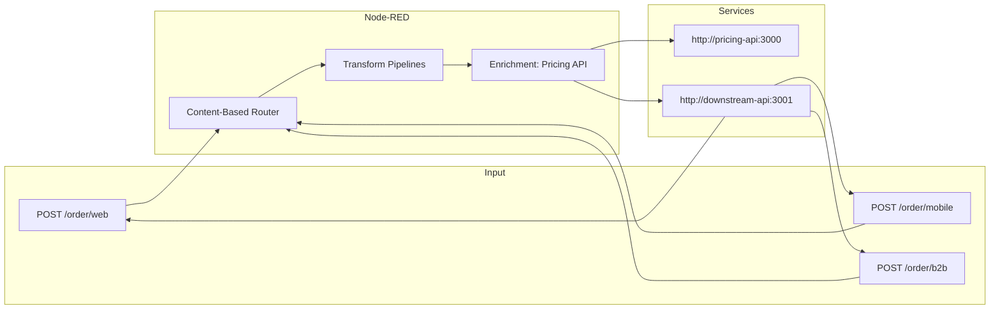

# Practice 1 — Message Routing & Transformation

**Course:** Enterprise Application Integration  
**Objective:** Build a Node-RED flow that routes, transforms, and enriches orders from multiple source formats into a canonical data model.

---

## Quick Start

1. **Copy environment configuration:**
   ```bash
   cp .env.example .env
   ```

2. **If ports are already in use**, edit `.env` to change the port numbers:
   ```
   NODE_RED_PORT=1880
   PRICING_API_PORT=3000
   DOWNSTREAM_API_PORT=3001
   ```

3. **Start the services:**
   ```bash
   docker-compose up -d
   ```

2. **Access Node-RED:**
   Open [http://localhost:1880](http://localhost:1880) in your browser.

3. **Explore the starter flow:**
   - Open the "Example" tab to see a hello-world reference flow
   - Your solution will go in a **new tab**

---

## Architecture Overview



---

## Services

| Service | Default URL | Purpose |
|---------|-------------|---------|
| Node-RED | http://localhost:${NODE_RED_PORT:-1880} | Student workspace for building flows |
| Pricing API | http://localhost:${PRICING_API_PORT:-3000} | Mock pricing enrichment API |
| Downstream API | http://localhost:${DOWNSTREAM_API_PORT:-3001} | Order receiver and validator |

**Note:** Inside Node-RED flows, use Docker service names (not `localhost`):
- Pricing API: `http://pricing-api:3000`
- Downstream API: `http://downstream-api:3001`

---

## Pricing API

### Endpoint
```
GET http://pricing-api:3000/pricing/:productId
```

### Authentication
Requires `X-API-Key` header. The API key is set in `docker-compose.yml`:

```yaml
environment:
  - PRICING_API_KEY=practice1-key-2024
```

### Full Product Catalog
```
GET http://pricing-api:3000/pricing
```

### Product ID Format
The pricing API uses `PROD-XXX` format (e.g., `PROD-001`, `PROD-002`).

| Source Format | Product ID | Normalization |
|--------------|------------|---------------|
| Web | `PROD-001` | No change needed |
| Mobile | `001` | Prepend `PROD-` → `PROD-001` |
| B2B | `SKU-PROD-001` | Strip `SKU-` prefix → `PROD-001` |

### Response Format
```json
{
  "productId": "PROD-001",
  "unitPrice": 24.99,
  "currency": "EUR",
  "taxRate": 0.21
}
```

---

## Downstream API

### Endpoints

| Method | Path | Purpose |
|--------|------|---------|
| POST | `/downstream/standard` | Receive standard (web) orders |
| POST | `/downstream/express` | Receive express (mobile) orders |
| POST | `/downstream/b2b` | Receive B2B orders |
| GET | `/downstream/:type/orders` | View received orders |
| DELETE | `/downstream/:type/orders` | Clear received orders |

### Validation
The downstream API validates orders against the canonical schema (`canonical-schema.json`).

**Success Response (200):**
```json
{
  "status": "accepted",
  "orderId": "WEB-2024-001",
  "validation": "passed"
}
```

**Error Response (400):**
```json
{
  "status": "rejected",
  "errors": [...]
}
```

---

## Test Data

### 1. Web Order (`test-data/web-order.json`)
- Format: JSON with nested objects
- orderType: `standard`
- Sample:
  ```bash
  curl -X POST http://localhost:1880/order/web \
    -H "Content-Type: application/json" \
    -d @test-data/web-order.json
  ```

### 2. Mobile Order (`test-data/mobile-order.json`)
- Format: Flat JSON with abbreviated fields
- orderType: `express`
- Note: Uses numeric product IDs, epoch timestamps, and integer status
- Sample:
  ```bash
  curl -X POST http://localhost:1880/order/mobile \
    -H "Content-Type: application/json" \
    -d @test-data/mobile-order.json
  ```

### 3. B2B Order (`test-data/b2b-order.xml`)
- Format: XML with EDI-style vocabulary
- orderType: `b2b`
- Sample:
  ```bash
  curl -X POST http://localhost:1880/order/b2b \
    -H "Content-Type: application/xml" \
    -d @test-data/b2b-order.xml
  ```

---

## Canonical Schema

The canonical order schema (`canonical-schema.json`) defines the standard format:

```json
{
  "orderId": "string",
  "orderType": "standard | express | b2b",
  "source": "web | mobile | b2b",
  "receivedAt": "ISO 8601 datetime",
  "customer": {
    "name": "string",
    "email": "string (email format)",
    "address": {
      "street": "string",
      "city": "string",
      "postalCode": "string",
      "country": "string"
    }
  },
  "items": [
    {
      "productId": "string",
      "productName": "string",
      "quantity": "integer (min 1)",
      "unitPrice": "number",
      "currency": "string",
      "taxRate": "number"
    }
  ],
  "currency": "string",
  "status": "new | processing | shipped | delivered",
  "orderDate": "ISO 8601 datetime"
}
```

### Key Transformation Requirements

| Source | Transformations |
|--------|-----------------|
| Mobile | Parse epoch → ISO 8601, parse address string → object, map integer status → string, map numeric currency code → string |
| B2B | XML → JSON, map EDI vocabulary → canonical names, lowercase status, strip SKU- from product IDs |
| Web | Mostly structural renaming (closest to canonical) |

---

## Grading

### Running Tests

```bash
cd grading
./run-tests.sh
```

### Scoring Breakdown

| Category | Points |
|----------|--------|
| Flow deploys without errors | 3 |
| Correct routing (all 3 types reach correct downstream) | 4 |
| Canonical transformation valid (schema validates) | 5 |
| Pricing enrichment works (fields populated) | 3 |
| Edge case handling (5 cases × 0.3 pts) | 1.5 |
| README quality | 3 (manual) |

**Total: 20 points**

---

## Your Deliverables

### Flow Screenshot
*[Paste a screenshot of your complete Node-RED flow here]*

### Integration Patterns Used
*[Describe the patterns you used: Content-Based Router, Message Translator, etc.]*

### Canonical Data Model
*[Explain how you designed the canonical data model and why]*

### Challenges Faced
*[Document any challenges you encountered and how you solved them]*

---

## Troubleshooting

### Node-RED not responding
- Check if container is running: `docker ps`
- View logs: `docker-compose logs nodered`

### Pricing API returns 401
- Ensure you're passing the `X-API-Key` header
- Check the API key in `docker-compose.yml`

### Orders not reaching downstream
- Check Node-RED debug panel
- Verify service names in flow (use `pricing-api:3000`, not `localhost:3000`)

### Reset everything
```bash
docker-compose down -v
docker-compose up -d
```
