# Session 3: EIP Routing Lab

A hands-on lab demonstrating Enterprise Integration Patterns (EIP) for message routing using RabbitMQ and Python microservices.

## Learning Objectives

By completing this lab, you will:

- Implement the **Splitter** pattern to decompose multi-item orders
- Implement the **Content-Based Router** pattern to route items by type
- Implement the **Aggregator** pattern to collect and combine results
- Understand correlation ID propagation across distributed services
- Gain practical experience with RabbitMQ queues and message flow

## Architecture Overview

```mermaid
flowchart TD
    subgraph Entry
        API[Order API]
    end
    
    subgraph Messaging["Message Broker (RabbitMQ)"]
        Q1[["📥 orders.incoming"]]
        Q2[["📦 orders.physical"]]
        Q3[["💾 orders.digital"]]
        Q4[["📊 orders.results"]]
        Q5[["✅ orders.complete"]]
    end
    
    subgraph Processing
        ROUTER[Router Service<br/>Splitter + CBR]
        INV[Inventory Worker]
        DIG[Digital Worker]
        AGG[Aggregator Service]
    end
    
    API -->|POST /orders| Q1
    Q1 --> ROUTER
    ROUTER -->|type: physical| Q2
    ROUTER -->|type: digital| Q3
    Q2 --> INV
    Q3 --> DIG
    INV --> Q4
    DIG --> Q4
    Q4 --> AGG
    AGG --> Q5
```



## Components

| Component | Role | Technology |
|-----------|------|------------|
| **RabbitMQ** | Message broker | Official Docker image |
| **Order API** | Receives orders, publishes to queue | Python (Flask) |
| **Router Service** | Splits orders, routes by item type | Python |
| **Inventory Worker** | Processes physical items | Python |
| **Digital Worker** | Processes digital items | Python |
| **Aggregator Service** | Collects results, produces final status | Python |

## Message Queues

| Queue | Purpose |
|-------|---------|
| `orders.incoming` | Receives new orders from the API |
| `orders.physical` | Physical items awaiting inventory processing |
| `orders.digital` | Digital items awaiting delivery processing |
| `orders.results` | Processed item results from workers |
| `orders.complete` | Final aggregated order status |

## EIP Patterns Demonstrated

| Pattern | Location | Description |
|---------|----------|-------------|
| **Splitter** | `router-service/app.py` | Breaks multi-item order into individual item messages |
| **Content-Based Router** | `router-service/app.py` | Routes items to queues based on `item.type` field |
| **Aggregator** | `aggregator-service/app.py` | Collects N results and produces final order status |

## API Documentation

The Order API is documented using OpenAPI 3.0. See [`order-api/openapi.yaml`](order-api/openapi.yaml) for the full specification.

When running via Docker Compose, open interactive Swagger UI at:

- http://localhost:8080/docs

The raw OpenAPI spec is available at:

- http://localhost:8080/openapi.yaml

**Endpoints:**
| Method | Path | Description |
|--------|------|-------------|
| `POST` | `/orders` | Submit a new order for processing |
| `GET` | `/health` | Health check endpoint |

Swagger UI also lets you execute requests directly from the browser ("Try it out").

## Prerequisites

- Docker and Docker Compose installed
- `curl` or similar HTTP client for testing
- (Optional) A REST client like Postman or Insomnia

## Quick Start

### 1. Start the Environment

```bash
cd labs/session-3-routing-lab
docker-compose up --build
```

Wait for all services to start. You should see output like:
```
eip-rabbitmq       | ... Server startup complete
eip-order-api      | * Running on http://0.0.0.0:8080
eip-router         | [Router] Waiting for orders...
eip-inventory-worker | [Inventory Worker] Waiting for physical items...
eip-digital-worker | [Digital Worker] Waiting for digital items...
eip-aggregator     | [Aggregator] Waiting for results...
```

### 2. Verify RabbitMQ Management UI

Open http://localhost:15672 in your browser.

- **Username:** `guest`
- **Password:** `guest`

Navigate to the **Queues** tab to see the declared queues.

### 3. Submit a Test Order

```bash
curl -X POST http://localhost:8080/orders \
  -H "Content-Type: application/json" \
  -d '{
    "customerId": "cust-123",
    "items": [
      {"type": "physical", "name": "Laptop", "price": 999.99},
      {"type": "digital", "name": "Software License", "price": 49.99},
      {"type": "physical", "name": "Mouse", "price": 29.99}
    ]
  }'
```

Expected response:
```json
{
  "orderId": "xxxxxxxx-xxxx-xxxx-xxxx-xxxxxxxxxxxx",
  "status": "received"
}
```

### 4. Observe the Message Flow

Watch the Docker Compose logs to see messages flow through the system:

```bash
docker-compose logs -f
```

You should see:
1. Order API receives the order and publishes to `orders.incoming`
2. Router splits the order into 3 items and routes them
3. Inventory Worker processes 2 physical items
4. Digital Worker processes 1 digital item
5. Aggregator collects all 3 results and publishes final status

### 5. Verify in RabbitMQ Management

Check the **Queues** tab:
- Messages should flow through each queue
- `orders.complete` should contain the final aggregated result

## Success Criteria

| Checkpoint | What to Verify | How to Verify |
|------------|----------------|---------------|
| 1. Environment Ready | RabbitMQ accessible | http://localhost:15672 loads |
| 2. Order Accepted | API receives order | `curl` returns 202 with orderId |
| 3. Splitter Working | Multiple messages from single order | RabbitMQ shows message count increase in physical/digital queues |
| 4. CBR Working | Items routed by type | Physical items in `orders.physical`, digital in `orders.digital` |
| 5. Workers Processing | Workers consuming messages | Service logs show processing |
| 6. Aggregator Completing | Final status produced | `orders.complete` queue has message |
| 7. Correlation Preserved | orderId consistent | All messages have same orderId |

## Viewing Service Logs

```bash
# All services
docker-compose logs -f

# Specific service
docker-compose logs -f router-service
docker-compose logs -f aggregator-service
```

## Stopping the Environment

```bash
docker-compose down
```

To also remove volumes (clears RabbitMQ data):
```bash
docker-compose down -v
```

## Stretch Goals (Optional)

### 1. Add Subscription Item Type (Easy, ~30 min)
- Create a `subscription-worker` service
- Extend router to route `type: "subscription"` to new queue
- Update `docker-compose.yml` with new service

### 2. Implement Dynamic Router (Medium, ~45 min)
- Add a `config.json` file for routing rules
- Router reads rules from file instead of hardcoded logic
- Hot-reload rules without restart

### 3. Add Scatter-Gather for Pricing (Hard, ~60 min)
- Create two inventory services with different prices
- Request prices from both, aggregate and select lowest
- Implement timeout handling

### 4. Implement Dead Letter Queue (Medium, ~30 min)
- Configure DLQ in RabbitMQ
- Add error simulation (random failures)
- Messages that fail 3 times go to DLQ

## Troubleshooting

### Port Conflicts
If ports 5672, 15672, or 8080 are in use:
```bash
# Check what's using the port (Windows)
netstat -ano | findstr :5672

# Or modify docker-compose.yml to use different ports
```

### Services Not Starting
```bash
# Rebuild all images
docker-compose build --no-cache

# Start fresh
docker-compose down -v
docker-compose up --build
```

### RabbitMQ Connection Errors
Services wait for RabbitMQ healthcheck, but if issues persist:
```bash
# Check RabbitMQ status
docker-compose logs rabbitmq

# Restart just RabbitMQ
docker-compose restart rabbitmq
```

## Project Structure


## References

- [Enterprise Integration Patterns](https://www.enterpriseintegrationpatterns.com/) - Hohpe & Woolf
- [RabbitMQ Documentation](https://www.rabbitmq.com/documentation.html)
- [Pika Python Client](https://pika.readthedocs.io/)
